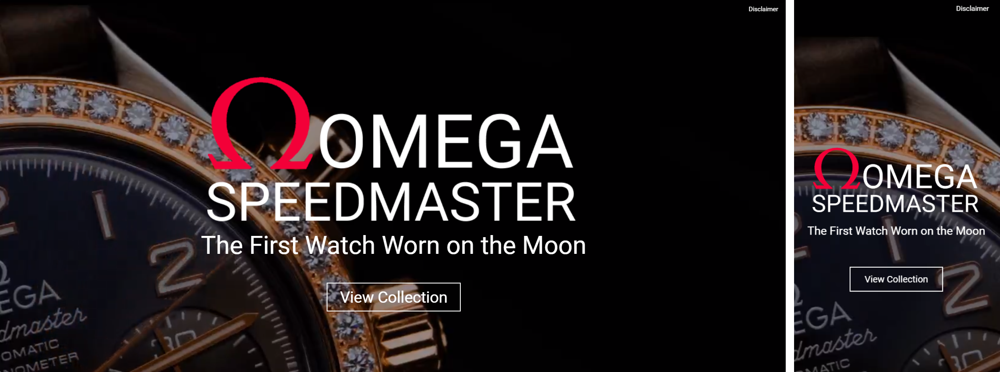

<h1>Description</h2>

This project is a product landing page that showcases the iconic Speedmaster watch, celebrated for its historical significance and timeless design. This project aims to highlight the watch's legacy as the first timepiece worn on the moon while providing an engaging user experience that reflects the elegance and precision of the Omega brand.
<h2>Project website URL </h2>
https://sameersharmadev.github.io/speedmaster/
 

<h2>Project Features</h2>

+ <h4>User friendly interface</h4>
  Designed with a clean layout that focuses on simplicity and ease of use.
+ <h4>Responsivene and clean design</h4>
  The website adapts seamlessly across all devices, ensuring an optimal user experience on mobile, tablet, and desktop.
  

<h2>Website breakdown</h2>

  + <b>Hero section:</b> The hero section is carefully crafted to immediately capture attention. A bold headline, engaging imagery, and a prominent CTA button are strategically placed to draw users in and encourage them to view the watch collection.
    
  + <b>Feature overview:</b>This section highlights the essential features of the Omega Speedmaster, enabling users to quickly grasp its unique value proposition. The Speedmaster is renowned not only for its elegant design but also for its historic significance in space exploration. Celebrated for its unparalleled precision, the Speedmaster has been an integral part of numerous NASA missions, including the historic Apollo moon landings.
    
  + <b>Purchase Sections:</b> A dedicated section that lists the featured watches of the Speedwatch collection, which directs them to their purchase. Additional option to view the full collection for specific models.
  + <b>Historic Significance:</b> A simple, effective carousel layout consisting important events that define historic significance of the Speedmaster, showcasing the precision the watch has to offer.
 
     

<h2>Technologies used</h2>

+ HTML, CSS, Javascript
+ TailwindCSS, SCSS
+ Other Tools: Font awesome

